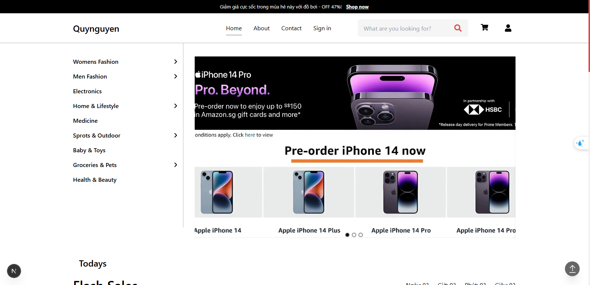

# Web bán hàng hiện đại
> Website thương mại điện tử UI hiện đại, responsive, sử dụng Next.js 15, TailwindCSS v3 và nhiều thư viện tiện ích khác.

---

##  Hướng dẫn cài đặt

```bash
npm install
npm run dev
```

---

##  Giao diện tham khảo

[Figma - Full E-Commerce Website UI/UX Design (Community)](https://www.figma.com/design/XBnGnDLxB4uHOrGGCEOVDC/Full-E-Commerce-Website-UI-UX-Design--Community-?node-id=34-213&t=BBKTvMTH1VOkKdM2-0)

---

##  Công nghệ sử dụng

### Framework
- **Next.JS v15**

### Thư viện
- `react-multi-carousel`
- `react-icons`
- `react-toastify`
- `tailwindcss` v3

---

##  Hình ảnh minh họa



---


